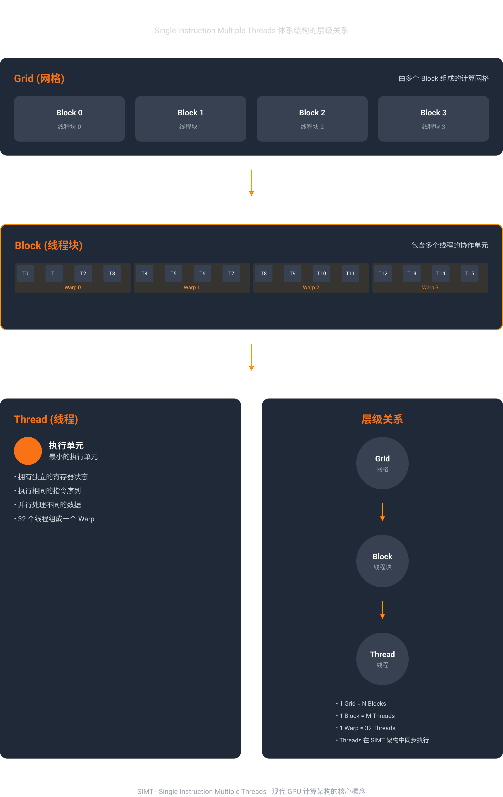
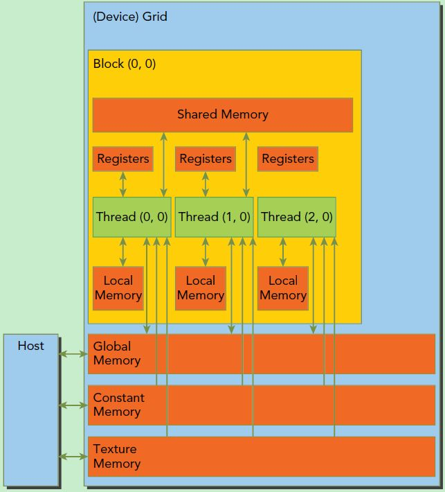

# MUSA SDK 5.2.0 编程指南重点笔记

> 整理日期：2026-09-07
>
> 这不是官方文档的替代品，而是面向本仓库 Week 1–6 路线的重点摘录。结论、参数上限和硬件行为以实际 SDK 版本、编译目标和设备查询结果为准。

官方入口：[MUSA SDK v5.2.0 编程指南](https://docs.mthreads.com/musa-sdk/version-5.2.0/programming_guide/)

## 1. 官方推荐学习路径

官方编程指南给出的主线是：

```text
入门 → 编程模型 → MUSA C++ 语法 → API → 硬件架构 → 性能优化
```

这个顺序和本仓库的 Week 1–6 基本一致：先理解 kernel 和线程，再学习内存/stream/API，最后进入归约、GEMM、FlashAttention 和性能分析。

官方文档将内容分成几组：

- 编程模型：Host/Device、线程层次、线程索引、内存层次、执行模型、L2 缓存、高级内存优化。
- MUSA C++：函数限定符、内置变量、kernel launch、原子函数、warp 函数、数学函数、低精度类型、Tensor/TME 和协作组。
- 高级功能：MUSA Graphs、Green Context 和 MP 资源隔离。
- 性能优化：瓶颈分析、性能工具、内存访问、计算、归约、GEMM/GEMV、FlashAttention。

## 2. Host / Device：先分清两套职责

Host（CPU）负责程序控制流、内存分配、数据传输、kernel 配置/启动和同步；Device（GPU）负责大规模并行计算。Host 和 Device 拥有不同的地址空间，普通 host/device buffer 之间需要显式传输。

```text
Host：准备数据 → 分配 device buffer → H2D → launch kernel → D2H → 校验/释放
Device：                         读取输入 → 并行计算 → 写回输出
```

最小的排错问题应该是：

1. 这个指针属于 host 还是 device？
2. 这次拷贝的方向是 H2D 还是 D2H？
3. kernel 是否已经完成，还是只是被异步提交？
4. 结果拷回之前有没有正确的 stream/event/device 同步？

对应代码：`code/week1/04_memory_basics.mu`、`code/week2/01_vector_add_runtime.mu`。

## 3. Grid / Block / Warp / Thread：逻辑层次和硬件层次

一次 kernel launch 对应一个 grid；grid 由多个可以独立调度的 block 组成；block 内的线程可以使用 shared memory 和 block-level barrier 协作。线程执行的基本小组是 warp，具体宽度应该通过 `warpSize` 查询，不应在通用代码中写死。

```text
一次 kernel launch
└── grid
    ├── block 0
    │   ├── warp 0
    │   └── warp 1
    └── block 1
        ├── warp 0
        └── warp 1
```

关键边界：

- block 之间不能依赖隐式执行顺序，也不能用 `__syncthreads()` 做跨 block 同步。
- 一个 block 应该可以被调度到任意 MP/SM 上，这正是自动可扩展性的基础。
- block 大小通常从 128、256、512 试起，但最终要结合寄存器、shared memory、warp 宽度和实测 occupancy。
- 使用向上取整保证所有数据都有线程覆盖：

```cpp
int blockSize = 256;
int gridSize = (n + blockSize - 1) / blockSize;
```

官方线程层次图（来源页面中的图示）：



> 图中的 `warp = 32 threads` 是示意图文字，不应作为所有 MTGPU 产品的固定结论；通用代码应读取 `warpSize`。官方线程层次页面也强调线程块可以被独立调度到任意 MP。

对应代码：`code/week1/01_hello_world.mu`、`code/week1/02_thread_index.mu`、`code/week3/06_sum_matrix_2d.mu`。

## 4. 线程索引：先写公式，再写业务逻辑

一维 kernel 的基本全局索引：

```cpp
int idx = blockIdx.x * blockDim.x + threadIdx.x;
if (idx < n) {
    output[idx] = input[idx];
}
```

二维图像或矩阵：

```cpp
int x = blockIdx.x * blockDim.x + threadIdx.x;
int y = blockIdx.y * blockDim.y + threadIdx.y;
if (x < width && y < height) {
    output[y * width + x] = input[y * width + x];
}
```

索引阅读顺序：

1. 先确定一个线程负责哪个逻辑元素。
2. 再确认 grid/block 的维度和向上取整。
3. 最后补边界检查，防止最后一个 block 越界。

## 5. 内存层次：容量、可见范围和访问代价一起看

```text
快 / 小 / 私有
    Register      每线程私有
    Shared memory Block 内共享
    L1 / L2 cache 由硬件缓存
    Constant      只读、适合广播/缓存
    Global        大容量、所有线程可访问、延迟高
    Host memory   CPU 系统内存
慢 / 大 / 需要传输
```

官方图示：



每次优化都要问：

- 数据是否被线程重复读取？可以放 shared 或缓存吗？
- 相邻线程是否访问相邻地址？能否形成 coalesced access？
- shared memory 是否需要 `__syncthreads()`？是否有 bank conflict？
- 局部变量是否造成过高寄存器压力，进而降低 occupancy？

对应代码：`code/week4/`、`code/week5/01_shared_basics.mu`、`code/week5/06_tiled_gemm.mu`。

## 6. SIMT、分支分化、延迟隐藏和 Occupancy

MUSA 的线程不是完全独立地执行任意指令，而是以 SIMT 方式由线程束共同推进。一个 warp 内如果线程走不同分支，硬件通常需要分别执行不同路径，再屏蔽不满足条件的线程，这就是 branch divergence。

常见优化方向：

- 让同一个 warp 内的线程尽量走相同分支。
- 用多个可驻留 warp 隐藏 global memory 延迟。
- 不要只追求更大的 block；寄存器和 shared memory 使用量过高会减少一个 MP/SM 上同时驻留的 block/warp 数量。
- 用 profiler 或 occupancy API 验证，而不是只凭 block size 猜性能。

同步边界要分清：

- `__syncthreads()`：block 级 barrier，要求参与线程的控制流一致。
- `__syncwarp()`：warp 级同步。
- warp vote/shuffle：线程协作原语，不自动等价于任意内存可见性或全局 barrier。

## 7. Stream / Event / Graph：控制 GPU 工作的时间线

```text
stream 0：H2D → kernel A → D2H
stream 1：H2D → kernel B → D2H
                  ↑
              event 可表达跨 stream 依赖
```

- 同一 stream 内操作通常按提交顺序执行。
- 不同 stream 只有在硬件资源、内存和依赖都允许时才可能并发。
- `musaMemcpyAsync` 想真正异步，通常需要 pinned host memory 等条件。
- event 适合表达 GPU 时间线上的完成点，也适合 kernel 计时。
- Graph 适合重复执行、拓扑稳定的操作，但是否更快必须实测。

对应代码：`code/week2/05_multi_stream.mu`、`06_stream_event_dep.mu`、`07_musa_graph.mu`。

## 8. MUSA C++ 语言扩展

常用函数限定符：

```cpp
__global__ void kernel(...);          // Host 调用，Device 执行
__device__ float f(float x);           // Device 调用，Device 执行
__host__ float g(float x);             // Host 执行
__host__ __device__ float h(float x);  // 两侧都可编译/调用
```

常用内置变量：`threadIdx`、`blockIdx`、`blockDim`、`gridDim`。kernel 的执行配置由 `<<<grid, block, shared_bytes, stream>>>` 表达。

注意：语言扩展、Runtime API 和 Driver API 是三层不同东西：

```text
MUSA C++ 语法：__global__ / threadIdx / __shared__ / <<<>>>
Runtime API：  musaMalloc / musaMemcpy / musaStreamCreate
Driver API：   muInit / muMemAddressReserve / muModuleLoad
```

## 9. 原子函数、Warp 原语和协作组

原子操作适合多个线程更新同一个地址的场景，例如计数器、直方图和局部归约。但原子操作不能免费消除竞争：热点地址上的大量线程会串行化。

推荐的思路通常是：

```text
线程局部累加 → warp/block 局部规约 → 少量 atomic 更新全局结果
```

warp 函数可用于投票、shuffle 和 warp 内归约；协作组则把线程组织、同步、归约、扫描和异步搬运封装成更高层的组抽象。使用时仍要确认参与线程范围、mask/width、同步语义和 MUSA 设备实际 warp 宽度。

## 10. 高级内存和 L2 持久化

SDK 5.2.0 的编程模型部分特别强调 pinned memory、zero-copy、L2 cache 管理、cluster memory 和异步执行。

L2 持久化适合“同一批数据被多个 kernel 反复访问”的场景，例如推理权重或查找表；一次性流式读取的数据则不适合强行保留。基本流程是：

1. 查询 `l2CacheSize`、`persistingL2CacheMaxSize` 和 `accessPolicyMaxWindowSize`。
2. 设置 device 的 persisting L2 预留空间。
3. 为 stream 设置 Access Policy Window。
4. 执行反复使用该数据的 kernel。
5. 用完后清理窗口并重置持久化缓存。

注意：L2 set-aside 是设备级资源，不是每个 stream 独占；多个 stream 的窗口可能互相竞争。是否有收益必须通过 profiler 或 event 计时验证。

## 11. 性能优化：先定位瓶颈，再选技术

官方性能路线可以归纳为：

```text
确认正确性 → 测量 → 判断瓶颈 → 做一个改动 → 再测量
```

### Roofline 的问题意识

算术强度约等于：

```text
执行 FLOP 数 / 访问内存字节数
```

算术强度低时，优先检查合并访存、数据布局、向量化和数据复用；算术强度高时，再重点看计算吞吐、指令级并行、寄存器和 Tensor/TME 路径。

### 常见优化检查表

- 全局内存：相邻线程是否访问相邻地址？
- 数据布局：AoS 是否可以改成 SoA？
- Shared：是否减少重复 global load？是否有 bank conflict？
- Block：是否为 warp 大小的合理倍数？是否受到寄存器/shared 限制？
- 分支：warp 内是否存在严重 divergence？
- 归约：能否用 shared、shuffle 或协作组减少全局原子竞争？
- GEMM/Attention：是否使用 tile、数据复用和在线算法减少中间结果落地？
- 工具：是否有 profiler 数据支持结论？

## 12. 和本仓库路线的对应关系

| 官方知识点 | 本仓库入口 |
|---|---|
| Host/Device、索引、kernel launch | `code/week1/` |
| Stream、Event、Graph、异步内存 | `code/week2/` |
| SIMT、warp、reduce、shuffle | `code/week3/` |
| 合并访存、布局、transpose | `code/week4/` |
| Shared、Constant、GEMM、muBLAS | `code/week5/` |
| 调试、多卡、MCCL、torch_musa | `code/week6/` |
| L2、虚拟内存、设备属性、GEMV/GEMM | `code/gpu-architecture-practice/` |

## 官方来源

- [v5.2.0 编程指南总览](https://docs.mthreads.com/musa-sdk/version-5.2.0/programming_guide/)
- [MUSA 编程模型](https://docs.mthreads.com/musa-sdk/version-5.2.0/programming_guide/programming_model/)
- [MUSA C++ 语言扩展](https://docs.mthreads.com/musa-sdk/version-5.2.0/programming_guide/musa_cpp_syntax/intro_to_musa_cpp/)
- [线程层次结构](https://docs.mthreads.com/musa-sdk/version-5.2.0/programming_guide/programming_model/thread_hierarchy/)
- [Host/Device 编程模型](https://docs.mthreads.com/musa-sdk/version-5.2.0/programming_guide/programming_model/host_device_model/)
- [L2 缓存管理](https://docs.mthreads.com/musa-sdk/version-5.2.0/programming_guide/programming_model/l2_cache_management/)
- [性能优化总览](https://docs.mthreads.com/musa-sdk/version-5.2.0/programming_guide/performance_tuning/)
- [性能优化快速开始](https://docs.mthreads.com/musa-sdk/version-5.2.0/programming_guide/performance_tuning/quickstart_optimization/)

图示资源来源：上述 v5.2.0 官方页面中的线程层次结构图和内存层次结构图；图片仅作为学习资料随来源链接保存。
